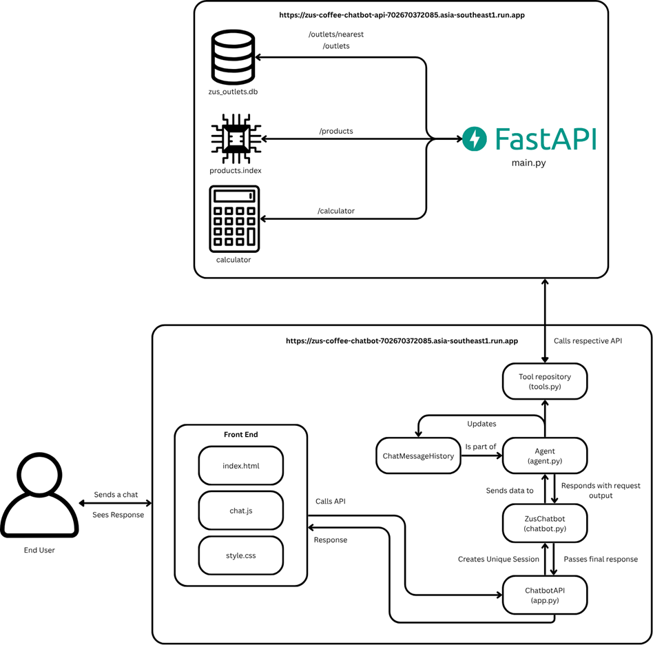

# zus-coffee-chatbot
To host locally, the data has to first be prepared. Start off by creating an .env file at the root of the project, then follow the following format:

OPENAI_API_KEY=your openai key
GOOGLE_API_KEY=your google key
FLASK_ENV=development

To get the libraries:
pip install -r requirements.txt
IN fastapi-backend
AND Agent

Then for the respective data.

Product Data:
1. run zus-coffee-chatbot\scripts\scrape_products.py
2. ensure data is collected through terminal
3. run zus-coffee-chatbot\scripts\ingest_products.py
4. ensure both products.index and products.pkl are generated

Outlets Data:
1. run zus-coffee-chatbot\scripts\outlet_link_scraper.py
2. confirm through terminal how many outlets were scraped, through testing the current system obtained 142
3. do not overdue the scraping, scrape once only just to obtain baseline data
4. run zus-coffee-chatbot\scripts\outlet_maps.py, ensure GOOGLE_API_KEY is populated
5. run zus-coffee-chatbot\scripts\zus_outlets_todb.py
6. to view the contents of the db, run zus-coffee-chatbot\scripts\view_db.py

Currently, the system is hosted using GCP where:
1. GUI is at https://zus-coffee-chatbot-702670372085.asia-southeast1.run.app 
2. API is at https://zus-coffee-chatbot-api-702670372085.asia-southeast1.run.app

Thus, the project points to the API url. However, in the case that local hosting is required, follow the steps below for the situation classified. 

IF API is still being hosted, but GUI is to be hosted locally:
1. replace every instance of https://zus-coffee-chatbot-api-702670372085.asia-southeast1.run.app with http://localhost:8000. Change the port in zus-coffee-chatbot\Agent\app.py at line port = int(os.getenv('PORT', 8080)), changing 8080 > 8000 
2. run command python app.py in terminal (ensure u are in Agent directory by calling cd Agent from root)

IF API is not being hosted anymore, and GUI is to be hosted locally:
1. replace every instance of https://zus-coffee-chatbot-api-702670372085.asia-southeast1.run.app with http://localhost:8000. Change the port in zus-coffee-chatbot\Agent\app.py at line port = int(os.getenv('PORT', 8080)), changing 8080 > 8000 
2. create 2 seperate terminals
3. in the first terminal, cd into fastapi-backend through cd fastapi-backend
4. while still being in the first terminal, run uvicorn app.main:app --port 8080 
5. ensure the server runs, then once application is started, proceed to the next step
6. in the second terminal, cd into Agent using cd Agent
7. while still being in the second terminal, run python app.py
8. ctrl+left click on the hosted link or visit http://localhost:8000

Architechture Overview

Key Trade Offs
1. Each router is seperated for modularity for easy testing purposes if an issue arises in one router, however this means that each router must be tested individually in the early stages of development which requires more testing time
2. Transformer models and FAISS index is loaded into memory which can reduce latency per request, but it requires some memory overhead
3. Currently the DB and vector store lives inside the API which makes it easy to startup and get the system running, but in the long term is unfeasible since larger DB and vector stores eat up more memory, of which future iterations must host them elsewhere
4. FAISS similarity search, while it is functional and returns the closest semantic meanings in the embeddings, will however always return a value even if not similar due to the small dataset size. To implement a value threshold in the future
5. Since the system is in early development at the moment, security leaves much to be desired such as authentication
6. The codebase, while it is functional, is not optimized yet and therefore response time leaves much to be desired
